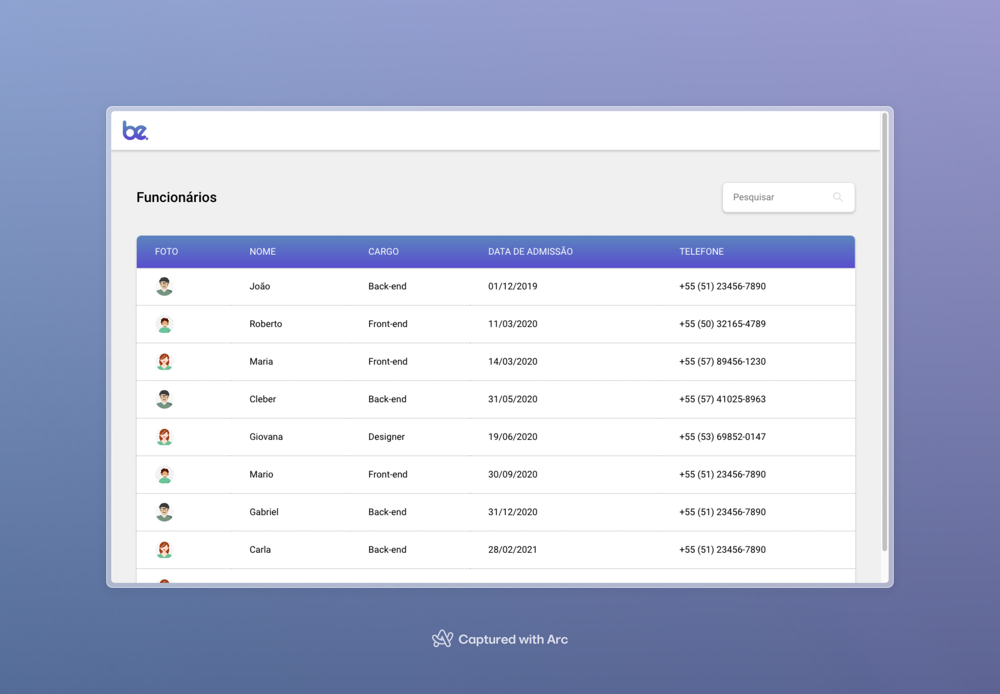
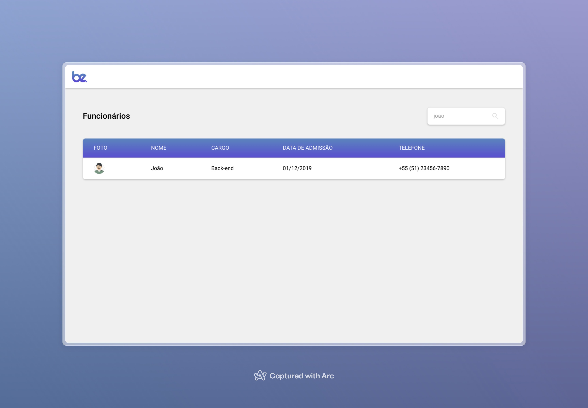
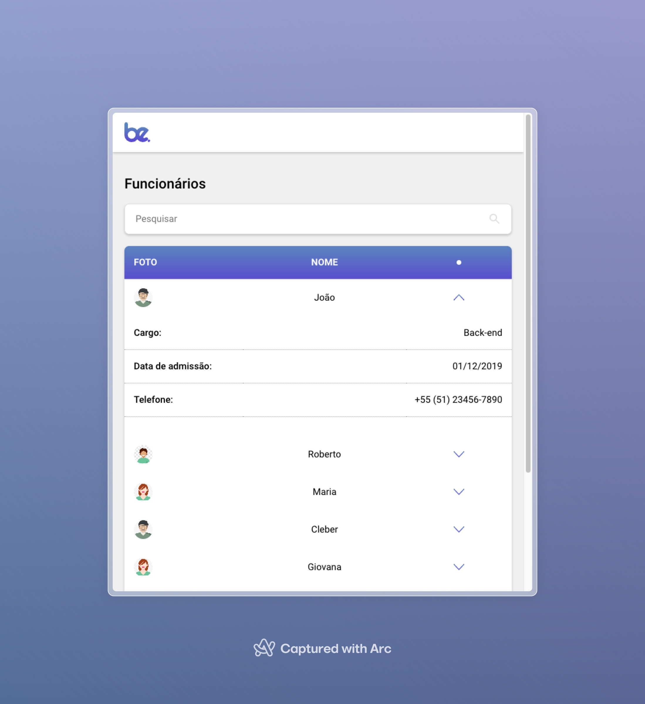

# Teste Técnico Front-end Be

## Sobre
Este projeto foi feito para o teste técnico em front-end da Be. Consiste em uma tabela com dados de funcionários que virão de uma API simulada, em json-server. O readme oficial do projeto está [aqui](tech-test.md).

## Pré-requisitos
- ✅ Deve-se utilizar React.js ou Vanilla JS (JavaScript puro) para construir o projeto. -> React.js

- ✅ É permitido utilizar libs externas, mas recomenda-se que seja o mínimo possível. -> Nenhuma lib foi utilizada.

- ✅ A visualização deve ser responsiva.

- ✅ A tabela deve conter as seguintes colunas: imagem (thumb do/a usuário/a), nome, cargo, data de admissão, telefone.

- ✅ Deve ser possível realizar pesquisa na tabela por meio de um input. O input de pesquisa deve permitir filtrar dados por cargo, nome e telefone.

- ✅ Datas e telefones devem ser formatadas no front-end e não na API.

## Diferenciais

- ✅ Usar TypeScript

## TechStack 🔧
- React ⚛️ 
- Vite ⚡ 
- CSS 🎨 
- Cypress 🧪 

## Instruções para rodar a aplicação
1) Faça o git clone do projeto:

``` shell
git clone git@github.com:lucas-adb/desafio-front-end.git
```

2) Entre na pasta do projeto:
``` shell
cd desafio-front-end
```

3) Instale as dependências:
``` shell
npm i
```

3) Rode o JSON Server:
``` shell
npm run server
```

4) Rode a aplicação
``` shell
npm run dev
```

5) Para rodar os testes 🧪:
``` shell
npm test
```

## Preview 📸


